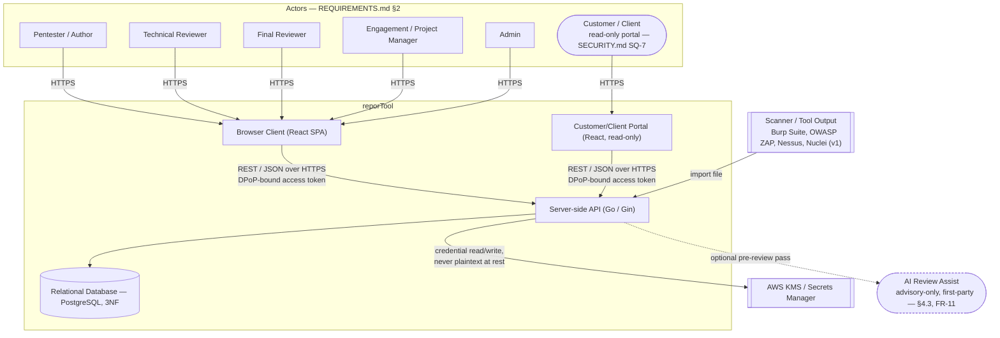
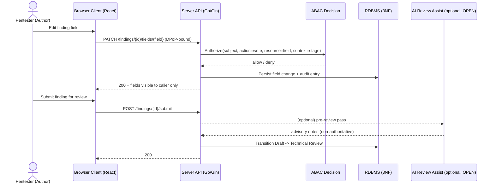
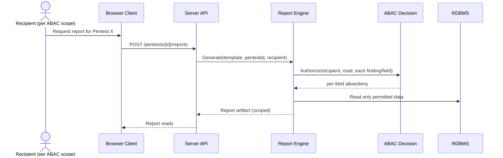
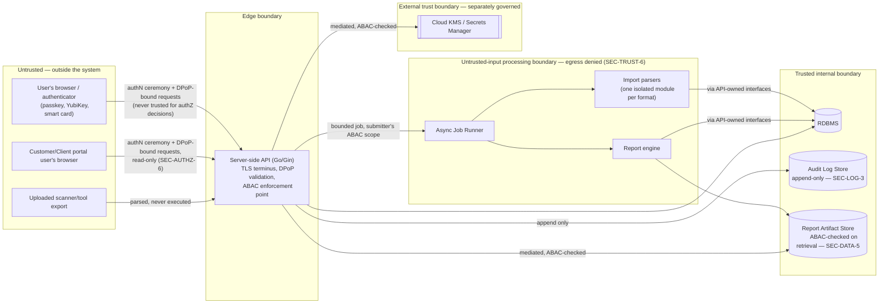

# Architecture

This document is the **source of truth** for HOW reporTool is built: logical components, interfaces, data flow, trust boundaries, and technology choices with rationale. It does not restate *what* the system does (`REQUIREMENTS.md`) or *how it looks/behaves in the UI* (`DESIGN.md`) — it explains how the two are realized as a system.

No implementation exists yet. Everything below is architected from `REQUIREMENTS.md` and `DESIGN.md`, not from imagined code or dependencies.

**Markers used throughout:**
- `UNKNOWN` — a fact the input documents do not provide.
- `TO BE DECIDED` — a decision not yet made.
- `ASSUMPTION` — an inference this document makes that is not explicitly stated in an input source. Never treat an `ASSUMPTION` as final.

Detailed security controls (threat model, cryptographic specifics, key management procedures, audit log design) belong to `SECURITY.md`, created next — this document defines trust boundaries and *where* controls apply, not their internals. File inventories, directory structures, deployment topology diagrams, and vendor comparisons belong to implementation, not here.

---

## Required Architecture Inputs

| Field | Value |
|---|---|
| Requirements source | REQUIREMENTS.md |
| Design source | DESIGN.md |
| System purpose | See REQUIREMENTS.md |
| Primary use cases | See REQUIREMENTS.md |
| Target users / actors | See REQUIREMENTS.md |
| Runtime environment | Web application, API monolith |
| Server framework | Go **1.27** baseline, Gin **v1.12.0** (SECURITY.md `REF-GIN-112`). |
| Client framework | React.js |
| API style and integration model | REST |
| Authentication | Passkey (WebAuthn) is the **minimum** authenticator for registration and login. YubiKey and smart card (PIV) are supported as additional/alternative authenticators. Target assurance level is **NIST 800-63 AAL3, authentication only** (no identity-proofing/IAL claim made). |
| Session | Sender-constrained sessions using **DPoP (Demonstrating Proof-of-Possession) JWTs** — a bearer token alone is not sufficient to use a session. |
| Data model expectations | Relational database, normalized to **Third Normal Form (3NF)** |
| Deployment model | **Terraform-managed infrastructure-as-code**, confirmed (SECURITY.md SQ-11). Cloud provider: **AWS**, single provider (SECURITY.md SQ-4). The architecture note "cloud model enterprise license (review)" remains `UNKNOWN` — flag for human review before an AWS licensing agreement is selected (SECURITY.md SQ-22). |
| Scale expectations | Hundreds of concurrent users. Not web-scale — design favors security and data integrity over horizontal throughput. |
| Security expectations | This system stores and manages live vulnerability data about pentest clients — a high-value target (REQUIREMENTS.md NFR-1). Detailed controls: see `SECURITY.md`. |

---

## Initial Architecture (Provisional)

Implementation-neutral wherever a technology decision is unresolved: no database product, cloud provider, hosting platform, messaging system, or vendor is chosen below unless an input source explicitly requires it. Where a `Required Architecture Inputs` field above locks in a technology (Go/Gin, React, REST, DPoP JWT, RDBMS/3NF), the component descriptions use that technology; everything else stays at the boundary/responsibility level.

### System context

### Logical components

- **Browser Client (React SPA)**
  - **Responsibility:** Renders finding/asset/report UI per `DESIGN.md`; enforces client-side UX affordances (inline validation feedback, keyboard operability, WCAG 2.2 AA presentation). Holds and presents *no* authoritative access-control or business-rule logic — it reflects decisions the API makes.
  - **Inputs:** User interaction; REST/JSON responses from the API (including which fields/actions are visible per the caller's ABAC decision).
  - **Outputs:** REST/JSON requests to the API, WebAuthn/passkey ceremonies delegated to the platform authenticator.
  - **Data owned or accessed:** No system-of-record data. Transient UI state only.
  - **Open decisions:** Platform targets (desktop-only vs. responsive/mobile) — `TO BE DECIDED`, DESIGN.md DQ-4. Light/dark mode — `TO BE DECIDED`, DESIGN.md "Required Design Inputs."

- **Customer/Client Portal (React, read-only)**
  - **Responsibility:** Separate, read-only surface for the Customer/Client actor (SECURITY.md SQ-7), scoped to only that customer's own data. Holds no authoritative access-control or business-rule logic, identical in that respect to the Browser Client.
  - **Inputs:** User interaction; REST/JSON responses from the API, already scoped to the caller's ABAC decision (SECURITY.md SEC-AUTHZ-6).
  - **Outputs:** Read-only REST/JSON requests to the API; WebAuthn/passkey ceremonies delegated to the platform authenticator.
  - **Data owned or accessed:** No system-of-record data. Transient UI state only.
  - **Open decisions:** Authentication assurance level for this actor — `TO BE DECIDED` (SECURITY.md SQ-14). Whether it is served from a separate origin, requiring CORS — `UNKNOWN` (SECURITY.md SEC-HTTP-3).

- **Server-side API (Go / Gin)**
  - **Responsibility:** Sole enforcement point for business rules and ABAC (REQUIREMENTS.md §6). Owns the finding lifecycle state machine (Draft → Technical Review → Final Review → Accepted, §5), CWE/ASVS mapping validation, and orchestration of the import and report subsystems. Every read/write to a customer, department, pentest, finding, or finding field is authorized here — never trusted from the client.
  - **Inputs:** REST requests from the browser client (bearer + DPoP proof); imported artefact files (§7); AI review-assist results (when enabled, FR-11).
  - **Outputs:** REST/JSON responses scoped to the caller's ABAC decision; audit log entries (NFR-2); generated report artifacts; credential read/write calls to the KMS boundary.
  - **Data owned or accessed:** All system-of-record business data via the persistence boundary — customers, departments, pentests, findings, finding fields, discovered assets, imported artefacts, review history, ABAC policy, report templates. Does not persist raw credential secret material itself (see Secrets/KMS Boundary).
  - **ABAC engine:** OPA/Rego (REQUIREMENTS.md §6.5, SECURITY.md SQ-1), loaded only as an integrity-verified, versioned policy artifact and failing closed when unavailable (SECURITY.md SEC-AUTHZ-8, SEC-AUTHZ-10; threats T-005, T-026). AI review-assist is advisory-only (SECURITY.md SQ-2). The finding lifecycle is enforced here as an explicit server-side state machine: Technical Review cannot be skipped, a `Rejected` terminal state exists (SECURITY.md SQ-9), and author/technical-reviewer/final-reviewer must be distinct actors (SECURITY.md SEC-WORKFLOW-1, SEC-AUTHZ-11; threats T-006, T-029).
  - **Open decisions:** none remaining for this component beyond REQUIREMENTS.md §12's list.

- **Identity & Session Handling** *(a responsibility within the API boundary, broken out because of its distinct trust properties — not a separate deployable unless a later decision splits it out)*
  - **Responsibility:** WebAuthn passkey registration/authentication as the baseline factor; YubiKey and smart-card (PIV) as supported additional/alternative authenticators; issuance and validation of sender-constrained DPoP-bound session tokens so a stolen bearer token alone cannot be replayed. Targets AAL3 (authentication only, no identity-proofing claim).
  - **Inputs:** WebAuthn/PIV ceremony results from the browser client; DPoP proof JWTs presented alongside each API call.
  - **Outputs:** Session/access tokens bound to a client-held key; authenticated subject + attributes (role, team, assigned engagements) passed to ABAC enforcement.
  - **Data owned or accessed:** User identity, credential public keys/attestation metadata, session/token state. Does not own business data.
  - **Step-up:** Required per sensitive action, not only at login (SECURITY.md SQ-3, SEC-AUTHN-3).
  - **Open decisions:** Concrete token/session lifetime and revocation model — `TO BE DECIDED` (SECURITY.md SQ-15).

- **Data Persistence (RDBMS, 3NF)**
  - **Responsibility:** System of record for the domain hierarchy (Customer → Department → Pentest → Finding → Finding Field), discovered assets, imported artefacts, review history, ABAC policy state, and report template metadata. Enforces referential integrity across the hierarchy so ABAC scoping (§6.1) is structurally sound, not just application-checked.
  - **Inputs:** Writes only from the Server-side API — no other component talks to the database directly.
  - **Outputs:** Query results to the API.
  - **Data owned or accessed:** All relational business data listed above. Does **not** store credential secret material in plaintext (§4.5, NFR-3) — see Secrets/KMS Boundary.
  - **Product:** PostgreSQL, hosted on AWS (e.g. RDS for PostgreSQL) (SECURITY.md SQ-10).

- **Secrets / Cloud KMS Boundary**
  - **Responsibility:** Backs engagement credentials (VPN access, scoped test accounts, API keys, §4.5) with a cloud KMS/secrets manager. The API mediates every access; the database never holds plaintext secret material (FR-17, NFR-3).
  - **Inputs:** Credential store/rotate/retrieve calls from the Server-side API, authorized by the same ABAC model as findings (FR-18).
  - **Outputs:** Decrypted credential material returned to the API only for an authorized, in-scope request; never returned to the browser client directly except as required for the authorized use.
  - **Data owned or accessed:** Engagement credential secret material, scoped per pentest.
  - **Provider:** AWS KMS + AWS Secrets Manager, single provider (SECURITY.md SQ-4). The architecture-notes item "cloud model enterprise license (review)" remains `UNKNOWN` — needs human review (SECURITY.md SQ-22).

- **Import Pipeline**
  - **Responsibility:** Parses raw tool output (v1: Burp Suite, OWASP ZAP, Nessus, Nuclei — REQUIREMENTS.md §7.1, SECURITY.md SQ-5) into normalized testing-artefact records with standardized types, rather than storing opaque blobs. May generate draft findings/notes from normalized artefacts. Each format has its own isolated parser module (SECURITY.md SEC-TRUST-3).
  - **Inputs:** Raw export files in the four v1 formats.
  - **Outputs:** Normalized artefact records linked to a pentest and, where applicable, to the findings/assets they support (FR-21).
  - **Data owned or accessed:** Imported Artefact records; writes through the Server-side API into the persistence boundary — no independent datastore.
  - **Open decisions:** Exact per-tool parser contract — `TO BE DECIDED`.

- **Report Engine**
  - **Responsibility:** Generates client-ready reports from structured finding/asset/artefact data plus a versioned template (§8), rather than hand-authored documents. Applies ABAC at generation time so a given recipient's report includes only the customer/department/pentest/finding/field data they are entitled to (FR-24, §8.4) — the engine calls the same authorization logic the API uses for interactive reads, it does not reimplement it.
  - **Inputs:** Finding/asset/artefact data (via the persistence boundary), a selected report template, the requesting/recipient identity and its ABAC scope.
  - **Outputs:** Generated report artifact(s) in **PDF and DOCX** (REQUIREMENTS.md §8.5, SECURITY.md SQ-6).
  - **Data owned or accessed:** Report template records (versioned, brandable per §8.2–8.3); reads (does not own) finding/asset/artefact data.
  - **Open decisions:** Whether an in-app preview precedes export — `TO BE DECIDED` (REQUIREMENTS.md §12). Whether artifacts are retrieved through the portal or exported out of the system — `TO BE DECIDED` (SECURITY.md SQ-31).

*The three components below were introduced by the 2026-09-21 STRIDE threat model (SECURITY.md). Each exists because a control could not be placed correctly on the previous component set; the driving threat is named.*

- **Async Job Runner** *(threats T-024, T-025; REQUIREMENTS.md FR-32)*
  - **Responsibility:** Executes import parsing and report generation outside the request path as tracked, resource-bounded jobs, so that a large or adversarial submission cannot consume request-handling capacity. Enforces the bounds in SECURITY.md SEC-TRUST-7 and runs in the egress-denied context required by SEC-TRUST-6.
  - **Inputs:** Job submissions from the Server-side API, carrying the submitting actor's identity and ABAC scope — a job never runs under a service or elevated identity (SEC-TRUST-5).
  - **Outputs:** Job status and failure reasons surfaced through the API; normalized artefact records and generated report artifacts written through the API's owning interfaces (DR-2).
  - **Data owned or accessed:** Transient job state only. Owns no business data.
  - **Open decisions:** Execution substrate (in-process worker pool vs. separate workers) and per-format resource limits — `TO BE DECIDED`.

- **Report Artifact Store** *(threat T-016; SECURITY.md SEC-DATA-5)*
  - **Responsibility:** Holds generated PDF/DOCX artifacts separately from the relational system of record. Retrieval is authorized on every access against the same OPA/Rego decision point that produced the artifact — possession of a URL grants nothing. Encrypted at rest with a defined retention period (SEC-DATA-5, SEC-DATA-6).
  - **Inputs:** Artifacts written by the Report Engine via the Server-side API; retrieval requests mediated by the API.
  - **Outputs:** Artifact bytes, only to an ABAC-authorized recipient.
  - **Data owned or accessed:** Generated report artifacts and their retention metadata. It does not own the generation record, which lives in the Audit Log Store (SEC-LOG-5).
  - **Open decisions:** Concrete storage service and retention period — `TO BE DECIDED` (SECURITY.md SQ-25, SQ-31).

- **Audit Log Store** *(threats T-010, T-013, T-014, T-030; REQUIREMENTS.md NFR-2)*
  - **Responsibility:** Append-only, tamper-evident record of access and change to findings, credentials, ABAC policy, administrative actions, lifecycle transitions (bound to the step-up authentication event, SEC-LOG-4), and report generation (SEC-LOG-5). It is a distinct store from the business database specifically so the application's database role cannot update or delete it (SEC-LOG-3), and so its retention is governed separately.
  - **Inputs:** Append-only writes from the Server-side API.
  - **Outputs:** Read access to authorized actors, itself ABAC-controlled.
  - **Data owned or accessed:** Audit and generation records. Owns no business data.
  - **Open decisions:** Backing store and integrity mechanism, and whether its retention is independent of business-data retention — `TO BE DECIDED` (SECURITY.md SQ-30).

### Primary data flows

### Trust boundaries

Business-rule and ABAC enforcement happens only inside the **edge boundary** (the API). The browser client is treated as fully untrusted input — it may only display what the API already decided to reveal. The KMS boundary is external and separately governed: the API mediates every credential access, and no other component talks to it directly.

The **untrusted-input processing boundary** was added by the 2026-09-21 threat model. Import parsing and report generation handle attacker-influenced content (scanner exports, uploaded templates, finding text originating from client systems), so they run outside the request path with outbound network access denied by default and no route to the cloud instance metadata service (SECURITY.md SEC-TRUST-6, threat T-018), under explicit resource bounds (SEC-TRUST-7, threats T-007/T-024/T-025), and under the submitting actor's ABAC scope rather than a service identity (SEC-TRUST-5, threats T-017/T-031). The **Audit Log Store** is separated from the RDBMS so that no application role — including Admin — can erase evidence of its own actions (SEC-LOG-3, threats T-010/T-030), and the **Report Artifact Store** is separated so a generated report is authorized on every retrieval rather than protected by URL secrecy (SEC-DATA-5, threat T-016).

---

## Requirement Traceability

| Component / boundary | Requirement group(s) | Status |
|---|---|---|
| Browser Client (React SPA) | FR-1, FR-5 (data entry UI); DESIGN.md accessibility/interaction requirements | SUPPORTED |
| Customer/Client Portal (React) | §2, SECURITY.md SQ-7, SEC-AUTHZ-6 | PARTIALLY DEFINED — read-only scope fixed; auth assurance level `TO BE DECIDED` (SQ-14) |
| Server-side API | FR-1–FR-25 (orchestrates all functional areas; authoritative enforcement) | SUPPORTED |
| Identity & Session Handling | FR-13, FR-14, FR-15 (subject attributes for ABAC); authentication factors per architecture notes | PARTIALLY DEFINED — mechanism (passkey/YubiKey/smart card, DPoP, AAL3) and step-up policy (SECURITY.md SQ-3) are fixed; concrete token lifetime/revocation values `TO BE DECIDED` (SQ-15) |
| Data Persistence (RDBMS, 3NF) | FR-2, FR-7, FR-9, FR-12, FR-13 (hierarchy integrity); §3 domain model | SUPPORTED — PostgreSQL (SECURITY.md SQ-10) |
| Secrets / Cloud KMS Boundary | FR-16, FR-17, FR-18 | SUPPORTED — AWS KMS/Secrets Manager (SECURITY.md SQ-4) |
| Import Pipeline | FR-6, FR-19, FR-20, FR-21; §7 | SUPPORTED — v1 scanner scope fixed (SECURITY.md SQ-5); per-tool parser contract `TO BE DECIDED` |
| Report Engine | FR-22, FR-23, FR-24, FR-25; §8 | PARTIALLY DEFINED — ABAC-aware generation, templating, and output formats (§8.5) defined; in-app preview `TO BE DECIDED` |
| ABAC Decision (cross-cutting, enforced within the Server-side API) | FR-13, FR-14, FR-15; §6.5 | SUPPORTED — OPA/Rego (SECURITY.md SQ-1) |
| AI-assisted review pass | FR-11 | SUPPORTED — advisory-only (SECURITY.md SQ-2); exact check list remains open (REQUIREMENTS.md §12) |
| Review lifecycle terminal/skip states | §5, FR-9, FR-10, FR-12 | SUPPORTED — no skip of Technical Review, `Rejected` terminal state added (SECURITY.md SQ-9) |
| Compliance / data-residency handling | §10, NFR-4 | PARTIALLY DEFINED — regimes fixed (SOC 2, GDPR, ISO 27001; SECURITY.md SQ-8); residency/evidence cadence `TO BE DECIDED` |
| Async Job Runner | FR-32; §9.5 | SUPPORTED — boundary and bounds fixed (SECURITY.md SEC-TRUST-6, SEC-TRUST-7; threats T-024, T-025); execution substrate and per-format limits `TO BE DECIDED` |
| Report Artifact Store | FR-24, FR-28, §8.4 | PARTIALLY DEFINED — per-retrieval authorization and encryption fixed (SECURITY.md SEC-DATA-5; threat T-016); storage service, retention period, and delivery model `TO BE DECIDED` (SQ-25, SQ-31) |
| Audit Log Store | NFR-2, FR-12, FR-26 | PARTIALLY DEFINED — append-only/tamper-evident properties and recorded events fixed (SECURITY.md SEC-LOG-3, SEC-LOG-4, SEC-LOG-5; threats T-010, T-013, T-014, T-030); backing store and integrity mechanism `TO BE DECIDED` (SQ-30) |
| Separation of duties in review | FR-27, §5 | SUPPORTED — enforced at the ABAC decision point (SECURITY.md SEC-AUTHZ-11; threat T-029); small-team exception path `TO BE DECIDED` (SQ-27) |
| Retention and disposal | FR-28, NFR-4 | PARTIALLY DEFINED — schedule is system-enforced and per-customer (SECURITY.md SEC-DATA-7; threat T-021); periods `TO BE DECIDED` (SQ-25) |

---

## Dependency Rules

- **DR-1** The Browser Client may call only the Server-side API's documented REST interface. It must not encode business rules, ABAC decisions, or direct data-access logic — any UI-side check is a convenience, never the authority, since the API re-validates every request regardless of what the client already showed.
- **DR-2** The Server-side API is the only component permitted to read from or write to the Data Persistence boundary. No other component (Browser Client, Import Pipeline, Report Engine) accesses the database directly; they operate through the API's internal interfaces.
- **DR-3** The Server-side API is the only component permitted to call the Secrets/Cloud KMS Boundary. Credential secret material is never persisted in the RDBMS and never forwarded to the Browser Client except as the specific, authorized output of a request the ABAC decision already approved.
- **DR-4** Vendor- or tool-specific behavior from an imported scanner/tool format must not leak past the Import Pipeline. Callers of normalized artefact data see only the standardized artefact types defined in REQUIREMENTS.md §7.3, regardless of source tool.
- **DR-5** Each business object in the domain hierarchy (Customer, Department, Pentest, Finding, Finding Field, Discovered Asset, Imported Artefact) has exactly one owning component (Data Persistence, mediated by the Server-side API) responsible for its mutation. The Report Engine and Import Pipeline read or append data through that owner; they do not maintain independent copies of business state.
- **DR-6** All access-control decisions — at every scope level (customer, department, pentest, finding, finding field) — are evaluated by a single ABAC decision point reachable only from within the Server-side API. No component (including the Report Engine) may implement a parallel or shortcut authorization check.
- **DR-7** Dependencies between boundaries must cross a documented interface (REST for Browser Client ↔ API; an internal service interface for API ↔ Import Pipeline/Report Engine; a data-access interface for API ↔ Persistence; a mediated credential interface for API ↔ KMS). No boundary may depend on another's internal implementation details, and no circular dependency between boundaries is permitted.
- **DR-9** Components inside the untrusted-input processing boundary (Async Job Runner, Import Pipeline, Report Engine) must not open outbound network connections, and must not reach the cloud instance metadata service or any internal service other than the API-owned interfaces they write through. A future need for an outbound call is an explicit, recorded allow-list decision, never a parser or renderer capability. *(SECURITY.md SEC-TRUST-6, threat T-018.)*
- **DR-10** The Audit Log Store is append-only from every direction: no component, and no database role used by the application, may update or delete its records. Components write audit entries only through the Server-side API's append interface. *(SECURITY.md SEC-LOG-3, threats T-010, T-030.)*
- **DR-11** A generated report artifact is reachable only through the Server-side API, which re-authorizes every retrieval against the same ABAC decision point that produced it. No component may serve artifacts directly, and no design may substitute an unguessable URL for that check. *(SECURITY.md SEC-DATA-5, threat T-016.)*
- **DR-8** These rules hold regardless of which RDBMS product, cloud provider(s), ABAC engine, or deployment topology are ultimately chosen — none of DR-1 through DR-7 and DR-9 through DR-11 assumes a specific vendor or framework beyond what `REQUIREMENTS.md` and the architecture notes already fix (Go/Gin, React, REST, DPoP, 3NF relational).

---

*Changes to this document should be made deliberately — it drives implementation decisions. When a requirement or design decision changes, update `REQUIREMENTS.md` or `DESIGN.md` first, then reflect the consequence here.*
